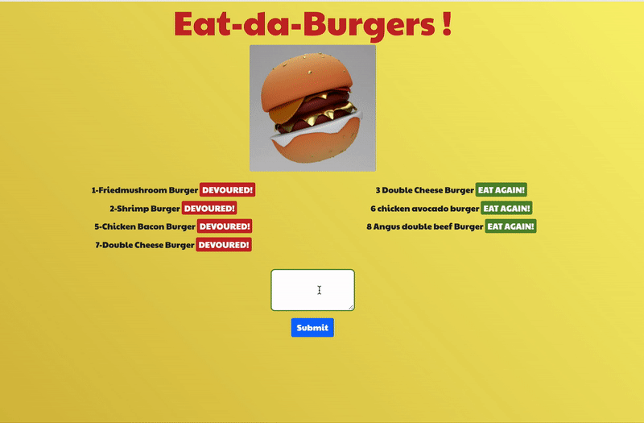

# [BURGER APP: Node Express Handlebars](https://evening-castle-79713.herokuapp.com/)

  # Table of Contents 

 - [Description](#description)
 - [Installation](#installation)
 - [User Stroy](#userstory)
  - [Business Context](#businesscontext)
 - [Contributing](#contributing)
 - [Credits](#credits)
 - [License](#license)
 - [Questions](#questions)

##  Description:

Create a bugger logger with MySQL, Node, Express, Handlebars and ORM.  Design and follow MVC(Model, View, Controll) pattern MySQL to query and route data and Handlebars to generate HTML. 

## Installation:

`npm install express mysql express-handlebars`

## User Story

Eat-Da-Burger! is a restaurant app that lets users input the names of burgers they'd like to eat.

Whenever a user submits a burger's name, your app will display the burger on the left side of the page -- waiting to be devoured.

Each burger in the waiting area also has a `Devour it!` button. When the user clicks it, the burger will move to the right side of the page. `Eat Again`

App will store every burger in a database, whether devoured or not.

## Contributing:

Triology and North Western Bootcamp provide starter gudie to Data base /Config /Model/ Controller /View set up 

 ## Credits:

 This is my work besides my tutor's advice. 

 ## Questions:

 For questions about the Generator you can go to my GitHub Page at the following Link:

 - [GitHub Profile](https://github.com/Oliviapark113)

 - [View Code](https://github.com/Oliviapark113/burgerapp_13)

   For additional questions please reach out to my email at: oliviaypark113@gmail.com

  ## Demo Project.

  

  ## Deployed Sites

 - [View deployed Sites](https://https://evening-castle-79713.herokuapp.com/)
